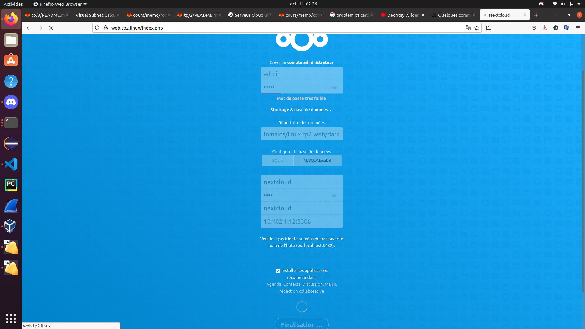
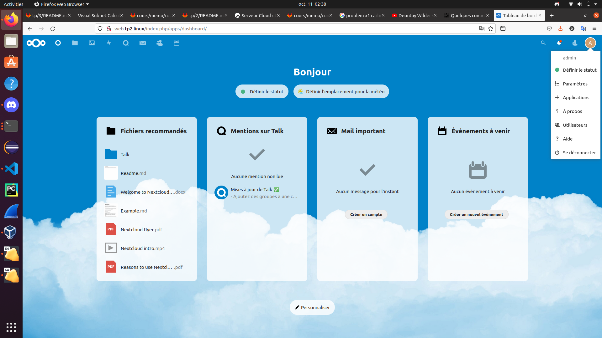

# TP2 pt. 1 : Gestion de service
# 0. Prérequis
## Checklist
# I. Un premier serveur web
## 1. Installation

**Installer le serveur Apache**

- paquet `httpd`
```
[adam@web ~]$ sudo dnf install -y httpd
[...]
Installed:
  apr-1.6.3-11.el8.1.x86_64                                                     
  apr-util-1.6.1-6.el8.1.x86_64                                                 
  apr-util-bdb-1.6.1-6.el8.1.x86_64                                             
  apr-util-openssl-1.6.1-6.el8.1.x86_64                                         
  httpd-2.4.37-39.module+el8.4.0+571+fd70afb1.x86_64                            
  httpd-filesystem-2.4.37-39.module+el8.4.0+571+fd70afb1.noarch                 
  httpd-tools-2.4.37-39.module+el8.4.0+571+fd70afb1.x86_64                      
  mod_http2-1.15.7-3.module+el8.4.0+553+7a69454b.x86_64                         
  rocky-logos-httpd-84.5-8.el8.noarch                                           

Complete!
```
- la conf se trouve dans `/etc/httpd/`
  - le fichier de conf principal est `/etc/httpd/conf/httpd.conf`
  - je vous conseille **vivement** de virer tous les commentaire du fichier, à défaut de les lire, vous y verrez plus clair
    - avec `vim` vous pouvez tout virer avec `:g/^ *#.*/d`
```
[adam@web ~]$ sudo cat /etc/httpd/conf/httpd.conf

ServerRoot "/etc/httpd"

Listen 80

Include conf.modules.d/*.conf

User apache
Group apache


ServerAdmin root@localhost


<Directory />
    AllowOverride none
    Require all denied
</Directory>


DocumentRoot "/var/www/html"

<Directory "/var/www">
    AllowOverride None
    Require all granted
</Directory>

```
**Démarrer le service Apache**

- le service s'appelle `httpd` (raccourci pour `httpd.service` en réalité)
  - démarrez le
```
[adam@web ~]$ sudo systemctl start httpd

[adam@web ~]$ sudo systemctl status httpd
● httpd.service - The Apache HTTP Server
   Loaded: loaded (/usr/lib/systemd/system/httpd.service; disabled; vendor preset: disabled)
   Active: active (running) since Wed 2021-09-29 17:44:43 CEST; 1min 0s ago
     Docs: man:httpd.service(8)
 Main PID: 27959 (httpd)
   Status: "Running, listening on: port 80"
    Tasks: 213 (limit: 11378)
   Memory: 24.3M
   CGroup: /system.slice/httpd.service
           ├─27959 /usr/sbin/httpd -DFOREGROUND
           ├─27960 /usr/sbin/httpd -DFOREGROUND
           ├─27961 /usr/sbin/httpd -DFOREGROUND
           ├─27962 /usr/sbin/httpd -DFOREGROUND
           └─27963 /usr/sbin/httpd -DFOREGROUND

Sep 29 17:44:43 web.tp2.linux systemd[1]: Starting The Apache HTTP Server...
Sep 29 17:44:43 web.tp2.linux systemd[1]: Started The Apache HTTP Server.
Sep 29 17:44:44 web.tp2.linux httpd[27959]: Server configured, listening on: port 80
```
  - faites en sorte qu'Apache démarre automatique au démarrage de la machine
```
[adam@web ~]$ sudo systemctl enable httpd
Created symlink /etc/systemd/system/multi-user.target.wants/httpd.service → /usr/lib/systemd/system/httpd.service.

[adam@web ~]$ sudo systemctl status httpd
● httpd.service - The Apache HTTP Server
   Loaded: loaded (/usr/lib/systemd/system/httpd.service; enabled; vendor preset: disabled)
   Active: active (running) since Wed 2021-09-29 17:44:43 CEST; 2min 24s ago
     Docs: man:httpd.service(8)
 Main PID: 27959 (httpd)
   Status: "Running, listening on: port 80"
    Tasks: 213 (limit: 11378)
   Memory: 24.3M
   CGroup: /system.slice/httpd.service
           ├─27959 /usr/sbin/httpd -DFOREGROUND
           ├─27960 /usr/sbin/httpd -DFOREGROUND
           ├─27961 /usr/sbin/httpd -DFOREGROUND
           ├─27962 /usr/sbin/httpd -DFOREGROUND
           └─27963 /usr/sbin/httpd -DFOREGROUND

Sep 29 17:44:43 web.tp2.linux systemd[1]: Starting The Apache HTTP Server...
Sep 29 17:44:43 web.tp2.linux systemd[1]: Started The Apache HTTP Server.
Sep 29 17:44:44 web.tp2.linux httpd[27959]: Server configured, listening on: port 80
```
- ouvrez le port firewall nécessaire
```
[adam@web ~]$ sudo firewall-cmd --add-port=80/tcp --permanent
success
```
- utiliser une commande `ss` pour savoir sur quel port tourne actuellement Apache
```
[adam@web ~]$ sudo ss -alnpt
State      Recv-Q     Send-Q           Local Address:Port           Peer Address:Port     Process                                                                                                          
LISTEN     0          128                    0.0.0.0:22                  0.0.0.0:*         users:(("sshd",pid=874,fd=5))                                                                                   
LISTEN     0          128                          *:80                        *:*         users:(("httpd",pid=27963,fd=4),("httpd",pid=27962,fd=4),("httpd",pid=27961,fd=4),("httpd",pid=27959,fd=4))     
LISTEN     0          128                       [::]:22                     [::]:*         users:(("sshd",pid=874,fd=7))                                                                                   
[adam@web ~]$ 
```
**TEST**
- vérifier que le service est démarré
```
[adam@web ~]$ systemctl status httpd
[...]
   Active: active (running) since Wed 2021-10-06 14:11:34 CEST; 4min 18s ago
[...]
```
- vérifier qu'il est configuré pour démarrer automatiquement
```
[adam@web ~]$ systemctl status httpd
[...]
   Loaded: loaded (/usr/lib/systemd/system/httpd.service; enabled; vendor prese>
[...]
```
- vérifier avec une commande `curl localhost` que vous joignez votre serveur web localement
```
[adam@web ~]$ curl localhost
<!doctype html>
<html>
  <head>
    <meta charset='utf-8'>
    <meta name='viewport' content='width=device-width, initial-scale=1'>
    <title>HTTP Server Test Page powered by: Rocky Linux</title>
    <style type="text/css">
      /*<![CDATA[*/
      
      html {
        height: 100%;
        width: 100%;
      }  
        body {
  background: rgb(20,72,50);
  background: -moz-linear-gradient(180deg, rgba(20,72,50,1) 30%, rgba(0,0,0,1) 90%)  ;
  background: -webkit-linear-gradient(180deg, rgba(20,72,50,1) 30%, rgba(0,0,0,1) 90%) ;
  background: linear-gradient(180deg, rgba(20,72,50,1) 30%, rgba(0,0,0,1) 90%);
  background-repeat: no-repeat;
  background-attachment: fixed;
  filter: progid:DXImageTransform.Microsoft.gradient(startColorstr="#3c6eb4",endColorstr="#3c95b4",GradientType=1); 
        color: white;
        font-size: 0.9em;
        font-weight: 400;
        font-family: 'Montserrat', sans-serif;
        margin: 0;
        padding: 10em 6em 10em 6em;
        box-sizing: border-box;      
        
      }

   
  h1 {
    text-align: center;
    margin: 0;
    padding: 0.6em 2em 0.4em;
    color: #fff;
    font-weight: bold;
    font-family: 'Montserrat', sans-serif;
    font-size: 2em;
  }
  h1 strong {
    font-weight: bolder;
    font-family: 'Montserrat', sans-serif;
  }
  h2 {
    font-size: 1.5em;
    font-weight:bold;
  }
  
  .title {
    border: 1px solid black;
    font-weight: bold;
    position: relative;
    float: right;
    width: 150px;
    text-align: center;
    padding: 10px 0 10px 0;
    margin-top: 0;
[...]
```
- vérifier avec votre navigateur (sur votre PC) que vous accéder à votre serveur web
```
adam@X1-Carbon:~$ curl 10.102.1.11:80
<!doctype html>
<html>
  <head>
    <meta charset='utf-8'>
    <meta name='viewport' content='width=device-width, initial-scale=1'>
    <title>HTTP Server Test Page powered by: Rocky Linux</title>
    <style type="text/css">
      /*<![CDATA[*/
      
      html {
        height: 100%;
        width: 100%;
      }  
        body {
  background: rgb(20,72,50);
  background: -moz-linear-gradient(180deg, rgba(20,72,50,1) 30%, rgba(0,0,0,1) 90%)  ;
  background: -webkit-linear-gradient(180deg, rgba(20,72,50,1) 30%, rgba(0,0,0,1) 90%) ;
  background: linear-gradient(180deg, rgba(20,72,50,1) 30%, rgba(0,0,0,1) 90%);
  background-repeat: no-repeat;
  background-attachment: fixed;
  filter: progid:DXImageTransform.Microsoft.gradient(startColorstr="#3c6eb4",endColorstr="#3c95b4",GradientType=1); 
        color: white;
        font-size: 0.9em;
        font-weight: 400;
        font-family: 'Montserrat', sans-serif;
        margin: 0;
        padding: 10em 6em 10em 6em;
        box-sizing: border-box;      
        
      }

   
  h1 {
    text-align: center;
    margin: 0;
    padding: 0.6em 2em 0.4em;
    color: #fff;
    font-weight: bold;
    font-family: 'Montserrat', sans-serif;
    font-size: 2em;
  }
  h1 strong {
    font-weight: bolder;
    font-family: 'Montserrat', sans-serif;
  }
  h2 {
    font-size: 1.5em;
    font-weight:bold;
  }
  
  .title {
    border: 1px solid black;
    font-weight: bold;
    position: relative;
    float: right;
    width: 150px;
    text-align: center;
    padding: 10px 0 10px 0;
    margin-top: 0;
  }
[...]
```
## 2. Avancer vers la maîtrise du service

🌞 **Le service Apache...**

- donnez la commande qui permet d'activer le démarrage automatique d'Apache quand la machine s'allume
```
sudo systemctl enable httpd
```
- prouvez avec une commande qu'actuellement, le service est paramétré pour démarré quand la machine s'allume
```
[adam@web ~]$ sudo systemctl status httpd
[...]
   Loaded: loaded (/usr/lib/systemd/system/httpd.service; enabled; vendor prese>
[...]
```
- affichez le contenu du fichier `httpd.service` qui contient la définition du service Apache
```
[adam@web system]$ cat httpd.service
# See httpd.service(8) for more information on using the httpd service.

# Modifying this file in-place is not recommended, because changes
# will be overwritten during package upgrades.  To customize the
# behaviour, run "systemctl edit httpd" to create an override unit.

# For example, to pass additional options (such as -D definitions) to
# the httpd binary at startup, create an override unit (as is done by
# systemctl edit) and enter the following:

#	[Service]
#	Environment=OPTIONS=-DMY_DEFINE

[Unit]
Description=The Apache HTTP Server
Wants=httpd-init.service
After=network.target remote-fs.target nss-lookup.target httpd-init.service
Documentation=man:httpd.service(8)

[Service]
Type=notify
Environment=LANG=C

ExecStart=/usr/sbin/httpd $OPTIONS -DFOREGROUND
ExecReload=/usr/sbin/httpd $OPTIONS -k graceful
# Send SIGWINCH for graceful stop
KillSignal=SIGWINCH
KillMode=mixed
PrivateTmp=true

[Install]
WantedBy=multi-user.target
```
**Déterminer sous quel utilisateur tourne le processus Apache**

- mettez en évidence la ligne dans le fichier de conf qui définit quel user est utilisé
```
[adam@web ~]$ sudo cat /etc/httpd/conf/httpd.conf
[...]
User apache
[...]
```
- utilisez la commande `ps -ef` pour visualiser les processus en cours d'exécution et confirmer que apache tourne bien sous l'utilisateur mentionné dans le fichier de conf
```
[adam@web ~]$ ps -ef
UID          PID    PPID  C STIME TTY          TIME CMD
[...]
apache      1291    1088  0 14:11 ?        00:00:00 /usr/sbin/httpd -DFOREGROUND
apache      1292    1088  0 14:11 ?        00:00:00 /usr/sbin/httpd -DFOREGROUND
apache      1293    1088  0 14:11 ?        00:00:00 /usr/sbin/httpd -DFOREGROUND
apache      1294    1088  0 14:11 ?        00:00:00 /usr/sbin/httpd -DFOREGROUND
[...]
adam        2106    1752  0 14:54 pts/0    00:00:00 ps -ef
```
- la page d'accueil d'Apache se trouve dans `/usr/share/testpage/`
- vérifiez avec un `ls -al` que tout son contenu est **accessible** à l'utilisateur mentionné dans le fichier de conf
*le fichier est accessible car on peut voir que dans la partie `autre` des permission il y a `r`*
```
[adam@web testpage]$ ls -al
total 12
drwxr-xr-x.  2 root root   24 Sep 29 17:41 .
drwxr-xr-x. 99 root root 4096 Sep 29 17:41 ..
-rw-r--r--.  1 root root 7621 Jun 11 17:23 index.html
```
**Changer l'utilisateur utilisé par Apache**

- créez le nouvel utilisateur
- pour les options de création, inspirez-vous de l'utilisateur Apache existant
```
[adam@web testpage]$ sudo adduser apache2 --home /usr/share/httpd --shell /sbin/nologin
adduser: warning: the home directory already exists.
Not copying any file from skel directory into it.
Creating mailbox file: File exists
```
- le fichier `/etc/passwd` contient les informations relatives aux utilisateurs existants sur la machine
- servez-vous en pour voir la config actuelle de l'utilisateur Apache par défaut
```
[adam@web testpage]$ cat /etc/passwd
apache:x:48:48:Apache:/usr/share/httpd:/sbin/nologin
apache2:x:1003:1004::/usr/share/httpd:/sbin/nologin
```
- modifiez la configuration d'Apache pour qu'il utilise ce nouvel utilisateur
```
[adam@web ~]$ sudo cat /etc/httpd/conf/httpd.conf
[...]
User apache2
[...]
```
- redémarrez Apache
```
[adam@web ~]$ sudo systemctl reload httpd
```
- utilisez une commande `ps` pour vérifier que le changement a pris effet
```
[adam@web ~]$ ps -ef
apache2     2882    1088  0 15:37 ?        00:00:00 /usr/sbin/httpd -DFOREGROUND
apache2     2883    1088  0 15:37 ?        00:00:00 /usr/sbin/httpd -DFOREGROUND
apache2     2884    1088  0 15:37 ?        00:00:00 /usr/sbin/httpd -DFOREGROUND
apache2     2885    1088  0 15:37 ?        00:00:00 /usr/sbin/httpd -DFOREGROUND
adam        3097    1752  0 15:37 pts/0    00:00:00 ps -ef
```
**Faites en sorte que Apache tourne sur un autre port**

- modifiez la configuration d'Apache pour lui demande d'écouter sur un autre port de votre choix
```
[adam@web ~]$ sudo cat /etc/httpd/conf/httpd.conf

ServerRoot "/etc/httpd"

Listen 9999
[...]
```
- ouvrez un nouveau port firewall, et fermez l'ancien
```
[adam@web ~]$ sudo firewall-cmd --add-port=9999/tcp --permanent
success
[adam@web ~]$ sudo firewall-cmd --remove-port=80/tcp --permanent
success
[adam@web ~]$ sudo firewall-cmd --list-all
public (active)
  target: default
  icmp-block-inversion: no
  interfaces: enp0s3 enp0s8
  sources: 
  services: cockpit dhcpv6-client ssh
  ports: 9999/tcp
  protocols: 
  masquerade: no
  forward-ports: 
  source-ports: 
  icmp-blocks: 
  rich rules: 
```
- redémarrez Apache
```
[adam@web ~]$ sudo systemctl reload httpd
[adam@web ~]$ 
```
- prouvez avec une commande `ss` que Apache tourne bien sur le nouveau port choisi
```
[adam@web ~]$ sudo ss -alnpt
State       Recv-Q      Send-Q           Local Address:Port           Peer Address:Port      Process                                                                                                       
LISTEN      0           128                    0.0.0.0:22                  0.0.0.0:*          users:(("sshd",pid=877,fd=5))                                                                                
LISTEN      0           128                          *:9999                      *:*          users:(("httpd",pid=3717,fd=4),("httpd",pid=3716,fd=4),("httpd",pid=3715,fd=4),("httpd",pid=3713,fd=4))      
LISTEN      0           128                       [::]:22                     [::]:*          users:(("sshd",pid=877,fd=7))                                                                                
[adam@web ~]$             
```
- vérifiez avec `curl` en local que vous pouvez joindre Apache sur le nouveau port
```
[adam@web ~]$ sudo systemctl status httpd
● httpd.service - The Apache HTTP Server
   Loaded: loaded (/usr/lib/systemd/system/httpd.service; enabled; vendor preset: disabled)
   Active: active (running) since Wed 2021-10-06 15:48:26 CEST; 2min 53s ago
     Docs: man:httpd.service(8)
  Process: 3185 ExecReload=/usr/sbin/httpd $OPTIONS -k graceful (code=exited, status=0/SUCCESS)
 Main PID: 3453 (httpd)
   Status: "Total requests: 4; Idle/Busy workers 100/0;Requests/sec: 0.0237; Bytes served/sec: 200 B/sec"
    Tasks: 213 (limit: 11378)
   Memory: 24.4M
   CGroup: /system.slice/httpd.service
           ├─3453 /usr/sbin/httpd -DFOREGROUND
           ├─3454 /usr/sbin/httpd -DFOREGROUND
           ├─3455 /usr/sbin/httpd -DFOREGROUND
           ├─3456 /usr/sbin/httpd -DFOREGROUND
           └─3457 /usr/sbin/httpd -DFOREGROUND

Oct 06 15:48:25 web.tp2.linux systemd[1]: Starting The Apache HTTP Server...
Oct 06 15:48:26 web.tp2.linux systemd[1]: Started The Apache HTTP Server.
Oct 06 15:48:26 web.tp2.linux httpd[3453]: Server configured, listening on: port 9999
[adam@web ~]$ sudo systemctl stop httpd
[adam@web ~]$ sudo systemctl start httpd
[adam@web ~]$ sudo systemctl status httpd
● httpd.service - The Apache HTTP Server
   Loaded: loaded (/usr/lib/systemd/system/httpd.service; enabled; vendor preset: disabled)
   Active: active (running) since Wed 2021-10-06 15:51:42 CEST; 2s ago
     Docs: man:httpd.service(8)
  Process: 3185 ExecReload=/usr/sbin/httpd $OPTIONS -k graceful (code=exited, status=0/SUCCESS)
 Main PID: 3713 (httpd)
   Status: "Started, listening on: port 9999"
    Tasks: 213 (limit: 11378)
   Memory: 24.2M
   CGroup: /system.slice/httpd.service
           ├─3713 /usr/sbin/httpd -DFOREGROUND
           ├─3714 /usr/sbin/httpd -DFOREGROUND
           ├─3715 /usr/sbin/httpd -DFOREGROUND
           ├─3716 /usr/sbin/httpd -DFOREGROUND
           └─3717 /usr/sbin/httpd -DFOREGROUND

Oct 06 15:51:42 web.tp2.linux systemd[1]: Starting The Apache HTTP Server...
Oct 06 15:51:42 web.tp2.linux systemd[1]: Started The Apache HTTP Server.
Oct 06 15:51:42 web.tp2.linux httpd[3713]: Server configured, listening on: port 9999
[adam@web ~]$ ss -alnpt
State                   Recv-Q                  Send-Q                                   Local Address:Port                                    Peer Address:Port                  Process                  
LISTEN                  0                       128                                            0.0.0.0:22                                           0.0.0.0:*                                              
LISTEN                  0                       128                                                  *:9999                                               *:*                                              
LISTEN                  0                       128                                               [::]:22                                              [::]:*                                              
[adam@web ~]$ sudo ss -alnpt
State       Recv-Q      Send-Q           Local Address:Port           Peer Address:Port      Process                                                                                                       
LISTEN      0           128                    0.0.0.0:22                  0.0.0.0:*          users:(("sshd",pid=877,fd=5))                                                                                
LISTEN      0           128                          *:9999                      *:*          users:(("httpd",pid=3717,fd=4),("httpd",pid=3716,fd=4),("httpd",pid=3715,fd=4),("httpd",pid=3713,fd=4))      
LISTEN      0           128                       [::]:22                     [::]:*          users:(("sshd",pid=877,fd=7))                                                                                
[adam@web ~]$ 


[adam@web ~]$ curl loacalhost
<!DOCTYPE HTML PUBLIC "-//IETF//DTD HTML 2.0//EN">
<html><head>
<title>301 Moved Permanently</title>
</head><body>
<h1>Moved Permanently</h1>
<p>The document has moved <a href="http://www.ynov.com/">here</a>.</p>
</body></html>
[adam@web ~]$ curl localhost
curl: (7) Failed to connect to localhost port 80: Connection refused
[adam@web ~]$ curl localhost:9999
<!doctype html>
<html>
  <head>
    <meta charset='utf-8'>
    <meta name='viewport' content='width=device-width, initial-scale=1'>
    <title>HTTP Server Test Page powered by: Rocky Linux</title>
    <style type="text/css">
      /*<![CDATA[*/
      
      html {
        height: 100%;
        width: 100%;
      }  
        body {
  background: rgb(20,72,50);
  background: -moz-linear-gradient(180deg, rgba(20,72,50,1) 30%, rgba(0,0,0,1) 90%)  ;
  background: -webkit-linear-gradient(180deg, rgba(20,72,50,1) 30%, rgba(0,0,0,1) 90%) ;
  background: linear-gradient(180deg, rgba(20,72,50,1) 30%, rgba(0,0,0,1) 90%);
  background-repeat: no-repeat;
  background-attachment: fixed;
  filter: progid:DXImageTransform.Microsoft.gradient(startColorstr="#3c6eb4",endColorstr="#3c95b4",GradientType=1); 
        color: white;
        font-size: 0.9em;
        font-weight: 400;
        font-family: 'Montserrat', sans-serif;
        margin: 0;
        padding: 10em 6em 10em 6em;
        box-sizing: border-box;      
        
      }
[...]
```
- vérifiez avec votre navigateur que vous pouvez joindre le serveur sur le nouveau port
```
adam@X1-Carbon:~$ curl 10.102.1.11:9999
<!doctype html>
<html>
  <head>
    <meta charset='utf-8'>
    <meta name='viewport' content='width=device-width, initial-scale=1'>
    <title>HTTP Server Test Page powered by: Rocky Linux</title>
    <style type="text/css">
      /*<![CDATA[*/
      
      html {
        height: 100%;
        width: 100%;
      }  
        body {
  background: rgb(20,72,50);
  background: -moz-linear-gradient(180deg, rgba(20,72,50,1) 30%, rgba(0,0,0,1) 90%)  ;
  background: -webkit-linear-gradient(180deg, rgba(20,72,50,1) 30%, rgba(0,0,0,1) 90%) ;
  background: linear-gradient(180deg, rgba(20,72,50,1) 30%, rgba(0,0,0,1) 90%);
  background-repeat: no-repeat;
  background-attachment: fixed;
  filter: progid:DXImageTransform.Microsoft.gradient(startColorstr="#3c6eb4",endColorstr="#3c95b4",GradientType=1); 
        color: white;
        font-size: 0.9em;
        font-weight: 400;
        font-family: 'Montserrat', sans-serif;
        margin: 0;
        padding: 10em 6em 10em 6em;
        box-sizing: border-box;      
        
        }
[...]
```

# II. Une stack web plus avancée

## 1. Intro

## 2. Setup

### A. Serveur Web et NextCloud

Install du serveur Web et de NextCloud sur `web.tp2.linux`

- n'oubliez pas de réinitialiser votre conf Apache avant de continuer
- remettez le port et le user par défaut en particulier
```
[adam@web ~]$ sudo cat /etc/httpd/conf/httpd.conf
[sudo] password for adam: 

ServerRoot "/etc/httpd"

Listen 80

Include conf.modules.d/*.conf

User apache
Group apache


ServerAdmin root@localhost
[...]
```
- déroulez [la doc d'install de Rocky](https://docs.rockylinux.org/guides/cms/cloud_server_using_nextcloud/#next-steps)
- **uniquement pour le serveur Web + NextCloud**, vous ferez la base de données MariaDB après
- quand ils parlent de la base de données, juste vous sautez l'étape, on le fait après :)
- je veux dans le rendu **toutes** les commandes réalisées
- n'oubliez pas la commande `history` qui permet de voir toutes les commandes tapées précédemment

**Installation et configuration des référenciels**

```
[adam@web ~]$ sudo dnf install -y epel-release
[sudo] password for adam: 
[...]
Installed:
  epel-release-8-13.el8.noarch                                                 

Complete!
```
```
[adam@web ~]$ sudo dnf update
[...]
Installed:
  grub2-tools-efi-1:2.02-99.el8_4.1.1.x86_64                                   
  kernel-4.18.0-305.19.1.el8_4.x86_64                                          
  kernel-core-4.18.0-305.19.1.el8_4.x86_64                                     
  kernel-modules-4.18.0-305.19.1.el8_4.x86_64                                  

Complete!
```
```
[adam@web ~]$ sudo dnf install https://rpms.remirepo.net/enterprise/remi-release-8.rpm
[...]
Installed:
  remi-release-8.4-1.el8.remi.noarch                                           

Complete!
```
```
[adam@web ~]$ sudo dnf module list php
[...]
Rocky Linux 8 - AppStream
Name     Stream       Profiles                       Summary                   
php      7.2 [d]      common [d], devel, minimal     PHP scripting language    
php      7.3          common [d], devel, minimal     PHP scripting language    
php      7.4          common [d], devel, minimal     PHP scripting language    

Remi's Modular repository for Enterprise Linux 8 - x86_64
Name     Stream       Profiles                       Summary                   
php      remi-7.2     common [d], devel, minimal     PHP scripting language    
php      remi-7.3     common [d], devel, minimal     PHP scripting language    
php      remi-7.4     common [d], devel, minimal     PHP scripting language    
php      remi-8.0     common [d], devel, minimal     PHP scripting language    
php      remi-8.1     common [d], devel, minimal     PHP scripting language    

Hint: [d]efault, [e]nabled, [x]disabled, [i]nstalled
```
```
[adam@web ~]$ sudo dnf module enable php:remi-7.4
Failed to set locale, defaulting to C.UTF-8
Last metadata expiration check: 0:01:37 ago on Wed Oct  6 17:27:46 2021.
Dependencies resolved.
===============================================================================
 Package           Architecture     Version            Repository         Size
===============================================================================
Enabling module streams:
 php                                remi-7.4                                  

Transaction Summary
===============================================================================

Is this ok [y/N]: y
Complete!
```
```
[adam@web ~]$ sudo dnf module list php
Failed to set locale, defaulting to C.UTF-8
Last metadata expiration check: 0:03:15 ago on Wed Oct  6 17:27:46 2021.
Rocky Linux 8 - AppStream
Name    Stream          Profiles                      Summary                  
php     7.2 [d]         common [d], devel, minimal    PHP scripting language   
php     7.3             common [d], devel, minimal    PHP scripting language   
php     7.4             common [d], devel, minimal    PHP scripting language   

Remi's Modular repository for Enterprise Linux 8 - x86_64
Name    Stream          Profiles                      Summary                  
php     remi-7.2        common [d], devel, minimal    PHP scripting language   
php     remi-7.3        common [d], devel, minimal    PHP scripting language   
php     remi-7.4 [e]    common [d], devel, minimal    PHP scripting language   
php     remi-8.0        common [d], devel, minimal    PHP scripting language   
php     remi-8.1        common [d], devel, minimal    PHP scripting language   

Hint: [d]efault, [e]nabled, [x]disabled, [i]nstalled
```

**Installation des paquets**

```
[adam@web ~]$ sudo dnf install httpd vim wget zip unzip libxml2 openssl php74-php php74-php-ctype php74-php-curl php74-php-gd php74-php-iconv php74-php-json php74-php-libxml php74-php-mbstring php74-php-openssl php74-php-posix php74-php-session php74-php-xml php74-php-zip php74-php-zlib php74-php-pdo php74-php-mysqlnd php74-php-intl php74-php-bcmath php74-php-gmp
[...]
php74-php-xml-7.4.24-1.el8.remi.x86_64                                       
php74-runtime-1.0-3.el8.remi.x86_64                                          
scl-utils-1:2.0.2-13.el8.x86_64                                              
tcl-1:8.6.8-2.el8.x86_64                                                     

Complete!
```
**Configuration apache**

```
[adam@web ~]$ sudo systemctl enable httpd
[adam@web ~]$ 
```

**history**
```
[...]
13  cd /var/sub-domains
   14  ls
   15  cd /var
   16  ls
   17  systemctl enable httpd
   18  sudo systemctl enable httpd
   19  sudo vim /etc/httpd/sites-available/linux.tp2.web
   20  cd /etc/httpd/
   21  mkdir sites-available
   22  sudo mkdir sites-available
   23  cd ..
   24  cd ~
   25  sudo vim /etc/httpd/sites-available/linux.tp2.web
   26  cd /etc/httpd/
   27  ls
   28  mkdir sites-enabled
   29  sudo mkdir sites-enabled
   30  cd ~
   31  sudo ln -s /etc/httpd/sites-available/linux.tp2.web /etc/httpd/sites-enabled/
   32  history
   33  mkdir -p /var/www/sub-domains/
   34  sudo mkdir -p /var/www/sub-domains/
   35  sudo mkdir -p /var/www/sub-domains/linux.tp2.web
   36  sudo mkdir -p /var/www/sub-domains/linux.tp2.web/html
   37  ls -al /etc/localtime
   38  sudo vim /etc/opt/remi/php74/php.ini
   39  sudo vim /etc/httpd/sites-available/linux.tp2.web
   40  sudo vim /etc/httpd/conf/httpd.conf
   41  sudo vim /etc/httpd/sites-available/linux.tp2.web
   42  sudo vim /etc/httpd/sites-enabled/linux.tp2.web
   43  ls
   44  sudo tm nextcloud-22.2.0.zip 
   45  sudo rm nextcloud-22.2.0.zip 
   46  ls
   47  wget https://download.nextcloud.com/server/releases/nextcloud-22.2.0.zip
   48  ls
   49  unzip nextcloud-22.2.0.zip 
   50  cd nextcloud/
   51  sudo cp -Rf * /var/www/sub-domains/com.yourdomain.nextcloud/html/
   52  sudo cp -Rf * /var/www/sub-domains/linux.tp2.web/html/
   53  ls -la /var/www/sub-domains/linux.tp2.web/html/
   54  chown apache:apache /var/www/sub-domains/linux.tp2.web/html/
   55  sudo chown apache:apache /var/www/sub-domains/linux.tp2.web/html/
   56  ls -la /var/www/sub-domains/linux.tp2.web/html/
   57  sudo chown -R apache web.tp2.linux/
   58  sudo chown -R apache linux.tp2.web/
   59  cd ~
   60  cd /var/www/sub-domains/
   61  ls -la
   62  chown apache:apache /var/www/sub-domains/linux.tp2.web/
   63  sudo chown apache:apache /var/www/sub-domains/linux.tp2.web/
   64  cd /var/www/sub-domains/linux.tp2.web/html/
   65  ls
   66  cd ..
   67  sudo mkdir data
   68  cd ~
   69  sudo systemctl restart httpd
   70  sudo cat /etc/httpd/conf/httpd.conf
   71  sudo vim /etc/httpd/conf/httpd.conf
   72  sudo systemctl restart httpd
   73  SElinux
   74  se status
   75  sestatus
   76  ls -la /var/www/sub-domains/linux.tp2.web/
   77  chmod -R apache /var/www/sub-domains/linux.tp2.web/
   78  cd  /var/www/sub-domains/linux.tp2.web/
   79  cd ..
   80  sudo chown -R apache web.tp2.linux/
   81  sudo chown -R apache linux.tp2.web/
   82  sudo chgrp -R apache linux.tp2.web/
   83  sudo systemctl restart httpd
   84  sudo systemctl status httpd
   85  history
```

### B. Base de données

**Install de MariaDB sur `db.tp2.linux`**

- déroulez [la doc d'install de Rocky](https://docs.rockylinux.org/guides/database/database_mariadb-server/)
- manipulation 
- je veux dans le rendu **toutes** les commandes réalisées
- vous repérerez le port utilisé par MariaDB avec une commande `ss` exécutée sur `db.tp2.linux`
```
[adam@db ~]$ history
    1  exit
    2  hostname
    3  sudo firewall-cmd --list-all
    4  sudo dnf install -y mariadb-server
    5  sudo systemctl enable mariadb
    6  sudo systemctl restart mariadb
    7  sudo systemctl status mariadb
    8  history
    9  sudo mysql -u root -p
   10  su
   11  sudo mysql -u root -p
   12  sudo mysql -u -p
   13  sudo mysql -u
   14  sudo mysql -u root
   15  sudo mysql -p
   16  sudo ss -alntp
   17  sudo mysql -u root -p
   18  sudo mysql_secure_installation
   19  history
```
```
[adam@db ~]$ sudo ss -alntp
[sudo] password for adam: 
State                Recv-Q               Send-Q                             Local Address:Port                               Peer Address:Port               Process                                      
LISTEN               0                    128                                      0.0.0.0:22                                      0.0.0.0:*                   users:(("sshd",pid=877,fd=5))               
LISTEN               0                    128                                         [::]:22                                         [::]:*                   users:(("sshd",pid=877,fd=7))               
LISTEN               0                    80                                             *:3306                                          *:*                   users:(("mysqld",pid=28161,fd=22))          
[adam@db ~]$ 
```

**Préparation de la base pour NextCloud**

- une fois en place, il va falloir préparer une base de données pour NextCloud :
  - connectez-vous à la base de données à l'aide de la commande `sudo mysql -u root -p`
```
[adam@db ~]$ sudo mysql -u root -p
Enter password: 
Welcome to the MariaDB monitor.  Commands end with ; or \g.
Your MariaDB connection id is 24
Server version: 10.3.28-MariaDB MariaDB Server

Copyright (c) 2000, 2018, Oracle, MariaDB Corporation Ab and others.

Type 'help;' or '\h' for help. Type '\c' to clear the current input statement.

MariaDB [(none)]> 
```
  - exécutez les commandes SQL suivantes :
```
MariaDB [(none)]> CREATE USER 'nextcloud'@'10.102.1.11' IDENTIFIED BY 'meow';
Query OK, 0 rows affected (0.001 sec)

MariaDB [(none)]>  
```
```
MariaDB [(none)]> CREATE DATABASE IF NOT EXISTS nextcloud CHARACTER SET utf8mb4 COLLATE utf8mb4_general_ci;
Query OK, 1 row affected (0.001 sec)

MariaDB [(none)]> 
```
```
MariaDB [(none)]> GRANT ALL PRIVILEGES ON nextcloud.* TO 'nextcloud'@'10.102.1.11';
Query OK, 0 rows affected (0.001 sec)

MariaDB [(none)]> 
```
```
MariaDB [(none)]> FLUSH PRIVILEGES;
Query OK, 0 rows affected (0.001 sec)

MariaDB [(none)]> 
```

**Exploration de la base de données**

- afin de tester le bon fonctionnement de la base de données, vous allez essayer de vous connecter, comme NextCloud le fera :
  - depuis la machine `web.tp2.linux` vers l'IP de `db.tp2.linux`
  - vous pouvez utiliser la commande `mysql` pour vous connecter à une base de données depuis la ligne de commande
    - par exemple `mysql -u <USER> -h <IP_DATABASE> -p`
```
[adam@web ~]$ sudo mysql -u nextcloud -h 10.102.1.12 -p
Enter password: 
Welcome to the MariaDB monitor.  Commands end with ; or \g.
Your MariaDB connection id is 9
Server version: 10.3.28-MariaDB MariaDB Server

Copyright (c) 2000, 2018, Oracle, MariaDB Corporation Ab and others.

Type 'help;' or '\h' for help. Type '\c' to clear the current input statement.

MariaDB [(none)]> 
```
- utilisez les commandes SQL fournies ci-dessous pour explorer la base
```
MariaDB [(none)]> SHOW DATABASES;
+--------------------+
| Database           |
+--------------------+
| information_schema |
| nextcloud          |
+--------------------+
2 rows in set (0.002 sec)

MariaDB [(none)]> USE nextcloud;
Database changed
MariaDB [nextcloud]> 

MariaDB [nextcloud]> SHOW TABLES;
Empty set (0.002 sec)

MariaDB [nextcloud]> 
```
- trouver une commande qui permet de lister tous les utilisateurs de la base de données
```
[adam@db ~]$ sudo mysql -u root -p
Enter password: 
Welcome to the MariaDB monitor.  Commands end with ; or \g.
Your MariaDB connection id is 8
Server version: 10.3.28-MariaDB MariaDB Server

Copyright (c) 2000, 2018, Oracle, MariaDB Corporation Ab and others.

Type 'help;' or '\h' for help. Type '\c' to clear the current input statement.

MariaDB [(none)]> SELECT user FROM mysql.user;
+-----------+
| user      |
+-----------+
| nextcloud |
| root      |
| root      |
| root      |
| root      |
+-----------+
5 rows in set (0.001 sec)

MariaDB [(none)]> 
```

### C. Finaliser l'installation de NextCloud

sur votre PC

- modifiez votre fichier `hosts` (oui, celui de votre PC, de votre hôte)
  - pour pouvoir joindre l'IP de la VM en utilisant le nom `web.tp2.linux`
```
adam@X1-Carbon:~$ cat /etc/hosts
127.0.0.1	localhost
127.0.1.1	X1-Carbon
10.102.1.11     web.tp2.linux
# The following lines are desirable for IPv6 capable hosts
::1     ip6-localhost ip6-loopback
fe00::0 ip6-localnet
ff00::0 ip6-mcastprefix
ff02::1 ip6-allnodes
ff02::2 ip6-allrouters
```
- avec un navigateur, visitez NextCloud à l'URL `http://web.tp2.linux`
  - c'est possible grâce à la modification de votre fichier `hosts`
- on va vous demander un utilisateur et un mot de passe pour créer un compte admin
  - ne saisissez rien pour le moment
- cliquez sur "Storage & Database" juste en dessous
  - choisissez "MySQL/MariaDB"
  - saisissez les informations pour que NextCloud puisse se connecter avec votre base
- saisissez l'identifiant et le mot de passe admin que vous voulez, et validez l'installation



**Exploration de la base de données**

- connectez vous en ligne de commande à la base de données après l'installation terminée
- déterminer combien de tables ont été crées par NextCloud lors de la finalisation de l'installation
  - ***bonus points*** si la réponse à cette question est automatiquement donnée par une requête SQL
```
[adam@web ~]$ sudo mysql -u nextcloud -h 10.102.1.12 -pmeow
[sudo] password for adam: 
Welcome to the MariaDB monitor.  Commands end with ; or \g.
Your MariaDB connection id is 77
Server version: 10.3.28-MariaDB MariaDB Server

Copyright (c) 2000, 2018, Oracle, MariaDB Corporation Ab and others.

Type 'help;' or '\h' for help. Type '\c' to clear the current input statement.

MariaDB [(none)]> 

MariaDB [(none)]> SHOW TABLES;
ERROR 1046 (3D000): No database selected
MariaDB [(none)]> SHOW DATABASES, SHOW TABLES;
ERROR 1064 (42000): You have an error in your SQL syntax; check the manual that corresponds to your MariaDB server version for the right syntax to use near ' SHOW TABLES' at line 1
MariaDB [(none)]> SHOW DATABASES;
+--------------------+
| Database           |
+--------------------+
| information_schema |
| nextcloud          |
+--------------------+
2 rows in set (0.002 sec)

MariaDB [(none)]> use nextcloud
Reading table information for completion of table and column names
You can turn off this feature to get a quicker startup with -A

Database changed
MariaDB [nextcloud]> SHOW TABLES;
+-----------------------------+
| Tables_in_nextcloud         |
+-----------------------------+
| oc_accounts                 |
| oc_accounts_data            |
| oc_activity                 |
| oc_activity_mq              |
| oc_addressbookchanges       |
| oc_addressbooks             |
| oc_appconfig                |
| oc_authtoken                |
| oc_bruteforce_attempts      |
| oc_calendar_invitations     |
| oc_calendar_reminders       |
| oc_calendar_resources       |
| oc_calendar_resources_md    |
| oc_calendar_rooms           |
| oc_calendar_rooms_md        |
| oc_calendarchanges          |
| oc_calendarobjects          |
| oc_calendarobjects_props    |
| oc_calendars                |
| oc_calendarsubscriptions    |
| oc_cards                    |
| oc_cards_properties         |
| oc_circles_circle           |
| oc_circles_event            |
| oc_circles_member           |
| oc_circles_membership       |
| oc_circles_mount            |
| oc_circles_mountpoint       |
| oc_circles_remote           |
| oc_circles_share_lock       |
| oc_circles_token            |
| oc_collres_accesscache      |
| oc_collres_collections      |
| oc_collres_resources        |
| oc_comments                 |
| oc_comments_read_markers    |
| oc_dav_cal_proxy            |
| oc_dav_shares               |
| oc_direct_edit              |
| oc_directlink               |
| oc_federated_reshares       |
| oc_file_locks               |
| oc_filecache                |
| oc_filecache_extended       |
| oc_files_trash              |
| oc_flow_checks              |
| oc_flow_operations          |
| oc_flow_operations_scope    |
| oc_group_admin              |
| oc_group_user               |
| oc_groups                   |
| oc_jobs                     |
| oc_known_users              |
| oc_login_flow_v2            |
| oc_mail_accounts            |
| oc_mail_aliases             |
| oc_mail_attachments         |
| oc_mail_classifiers         |
| oc_mail_coll_addresses      |
| oc_mail_mailboxes           |
| oc_mail_message_tags        |
| oc_mail_messages            |
| oc_mail_provisionings       |
| oc_mail_recipients          |
| oc_mail_tags                |
| oc_mail_trusted_senders     |
| oc_migrations               |
| oc_mimetypes                |
| oc_mounts                   |
| oc_notifications            |
| oc_notifications_pushhash   |
| oc_oauth2_access_tokens     |
| oc_oauth2_clients           |
| oc_preferences              |
| oc_privacy_admins           |
| oc_properties               |
| oc_ratelimit_entries        |
| oc_recent_contact           |
| oc_richdocuments_assets     |
| oc_richdocuments_direct     |
| oc_richdocuments_wopi       |
| oc_schedulingobjects        |
| oc_share                    |
| oc_share_external           |
| oc_storages                 |
| oc_storages_credentials     |
| oc_systemtag                |
| oc_systemtag_group          |
| oc_systemtag_object_mapping |
| oc_talk_attendees           |
| oc_talk_bridges             |
| oc_talk_commands            |
| oc_talk_internalsignaling   |
| oc_talk_rooms               |
| oc_talk_sessions            |
| oc_text_documents           |
| oc_text_sessions            |
| oc_text_steps               |
| oc_trusted_servers          |
| oc_twofactor_backupcodes    |
| oc_twofactor_providers      |
| oc_user_status              |
| oc_user_transfer_owner      |
| oc_users                    |
| oc_vcategory                |
| oc_vcategory_to_object      |
| oc_webauthn                 |
| oc_whats_new                |
+-----------------------------+
108 rows in set (0.003 sec)

MariaDB [nextcloud]> 
```
L'ors de la finalisation de l'installation 108 tables ont donc été créee

**Pour voir les ports ouverts**
```
[adam@db ~]$ sudo ss -alntp
[sudo] password for adam: 
State                Recv-Q               Send-Q                             Local Address:Port                               Peer Address:Port               Process                                      
LISTEN               0                    128                                      0.0.0.0:22                                      0.0.0.0:*                   users:(("sshd",pid=877,fd=5))               
LISTEN               0                    128                                         [::]:22                                         [::]:*                   users:(("sshd",pid=877,fd=7))               
LISTEN               0                    80                                             *:3306                                          *:*                   users:(("mysqld",pid=29399,fd=22))          
[adam@db ~]$ 
```
```
[adam@web ~]$ sudo ss -alntp
[sudo] password for adam: 
State    Recv-Q   Send-Q     Local Address:Port     Peer Address:Port   Process                                                                                                                            
LISTEN   0        128              0.0.0.0:22            0.0.0.0:*       users:(("sshd",pid=875,fd=5))                                                                                                     
LISTEN   0        128                    *:80                  *:*       users:(("httpd",pid=7079,fd=4),("httpd",pid=2401,fd=4),("httpd",pid=2400,fd=4),("httpd",pid=2399,fd=4),("httpd",pid=2396,fd=4))   
LISTEN   0        128                 [::]:22               [::]:*       users:(("sshd",pid=875,fd=7))                                                                                                     
LISTEN   0        80                     *:3306                *:*       users:(("mysqld",pid=14476,fd=22))                                                                                                
[adam@web ~]$ 
```

| Machine         | IP            | Service                 | Port ouvert | IP autorisées |
|-----------------|---------------|-------------------------|-------------|---------------|
| `web.tp2.linux` | `10.102.1.11` | Serveur Web             | 22/80/3306  | 10.102.1.12   |
| `db.tp2.linux`  | `10.102.1.12` | Serveur Base de Données | 22/3306     | 10.102.1.11   |


